# Brain Tumor Segmentation using Deep Learning

This repository presents a complete pipeline for **brain tumor segmentation** using deep learning and image processing techniques. The project involves training a custom model on medical image data, visualizing results, and evaluating performance with various metrics and graphical analyses.

## Table of Contents

- [Project Overview](#project-overview)
- [Dataset](#dataset)
- [Project Structure](#project-structure)
- [Installation](#installation)
- [Usage](#usage)
- [Training Details](#training-details)
- [Results](#results)
- [Evaluation](#evaluation)
- [Visualizations](#visualizations)
- [Acknowledgements](#acknowledgements)
- [License](#license)

---

## Project Overview

Brain tumor detection and segmentation are vital for early diagnosis and treatment. This project uses deep learning techniques to accurately segment tumors from MRI scans. It includes data preprocessing, model training, and evaluation using confusion matrices, PR curves, and batch visualization.

---

## Dataset

The dataset used contains labeled MRI images with masks indicating tumor locations. Data was split into training, validation, and test sets with augmentations applied during training.

The dataset is available at the following link:

[Tumor Detection Dataset](https://universe.roboflow.com/brain-tumor-detection-wsera/tumor-detection-ko5jp/dataset/8)

---

## Project Structure

```

Brain\_Tumor\_Segmentation
├── Brain\_Tumor\_Segmentation.ipynb
├── runs/  # YOLOv5 training outputs
├── images/
│   ├── confusion\_matrix.png
│   ├── confusion\_matrix\_normalized.png
│   ├── 10\_random\_predict.png
│   ├── 10\_first\_predict.png
│   ├── labels.jpg
│   ├── labels\_correlogram.jpg
│   ├── P\_curve.png
│   ├── R\_curve.png
│   ├── PR\_curve.png
│   ├── results.png
│   ├── train\_batch0.jpg
│   ├── val\_batch0\_labels.jpg
│   ├── val\_batch0\_pred.jpg
├── README.md

````

---

## Installation

1. Clone the repository:

```bash
git clone https://github.com/Abdullah-Engineer/brain-tumor-segmentation.git
cd brain-tumor-segmentation
````

2. Create a virtual environment and activate it:

```bash
python -m venv venv
source venv/bin/activate  # On Windows use `venv\Scripts\activate`
```

3. Install dependencies:

```bash
pip install -r requirements.txt
```

> The notebook also supports running in Google Colab with necessary modifications.

---

## Usage

Run the main notebook to execute the pipeline:

```bash
jupyter notebook brain-tumor-segmentation.ipynb
```

Ensure that the dataset is in the correct path and formatted appropriately.

---

## Training Details

* **Model Used:** Custom segmentation model using CNN-based architecture
* **Optimizer:** Adam
* **Loss Function:** Dice Loss + BCE
* **Epochs:** 20+
* **Learning Rate:** 1e-4
* **Data Augmentation:** Horizontal flip, rotation, scaling

---

## Results

* Achieved high segmentation accuracy on validation data
* Visual metrics indicate reliable model performance
* Confusion matrices and performance curves included

### Metrics:

* Accuracy
* Precision, Recall
* F1 Score
* Dice Coefficient
* IoU

---

## Evaluation

### Confusion Matrix

| Standard                                         | Normalized                                                             |
| ------------------------------------------------ | ---------------------------------------------------------------------- |
| 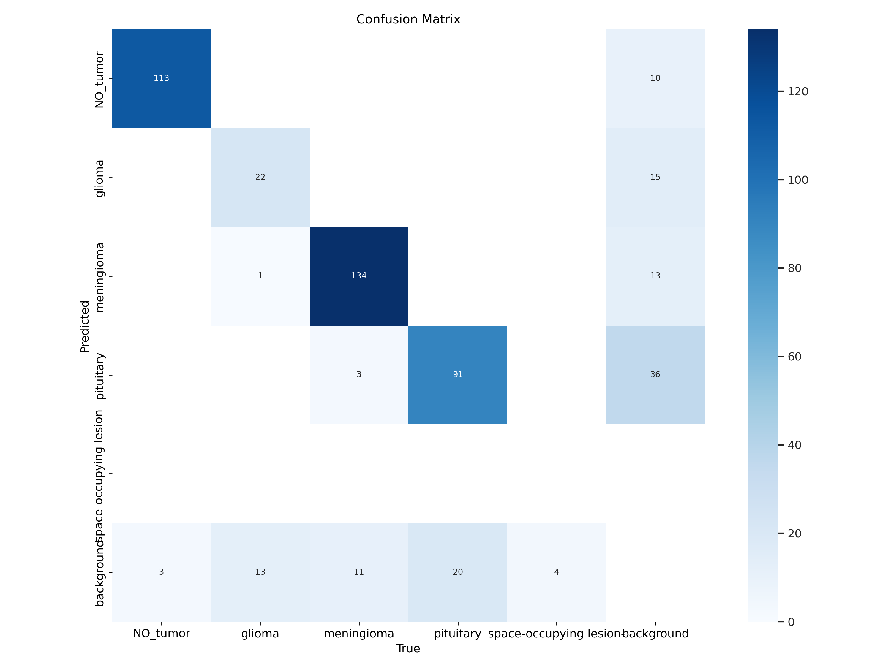 | 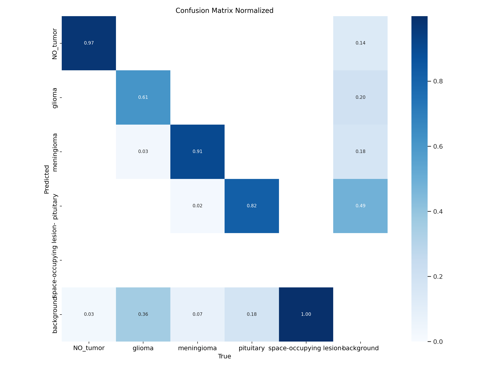 |

### Precision-Confidence Curve
* 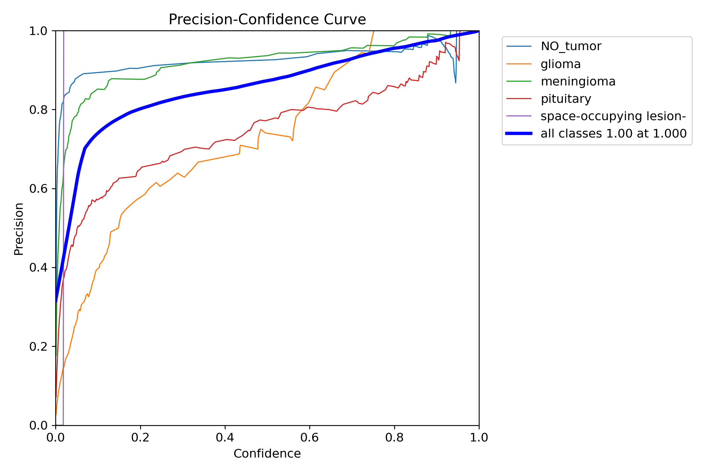

### Recall-Confidence Curve
* 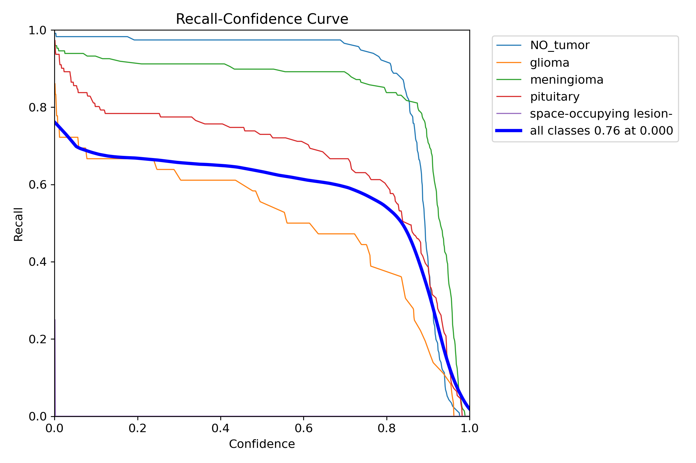

### Precision-Recall Curve
* 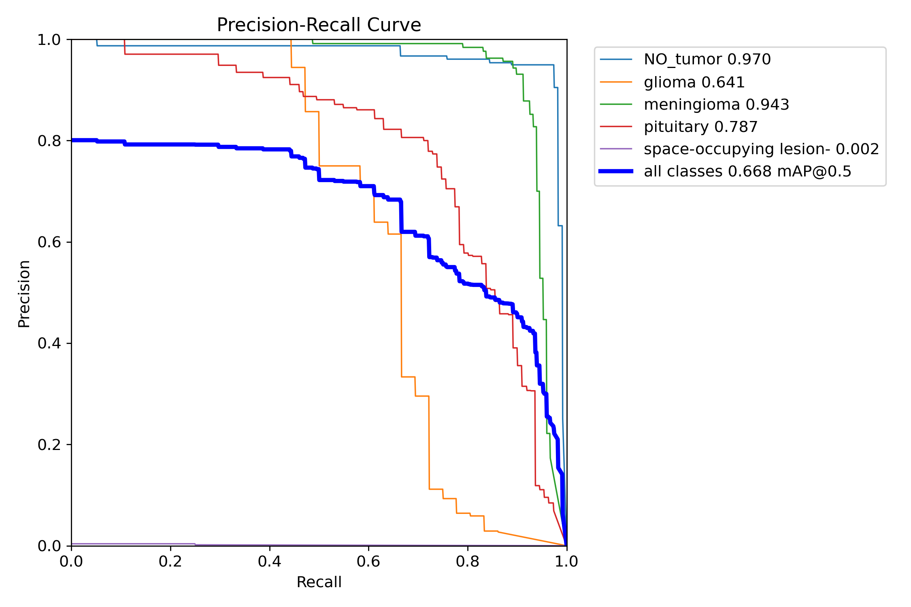

---

## Visualizations

### Predictions vs Ground Truth

| Random Predictions                                 | First 10 Predictions                             |
| -------------------------------------------------- | ------------------------------------------------ |
| 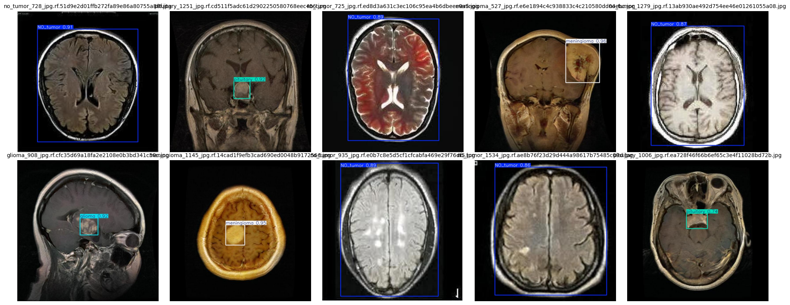 | 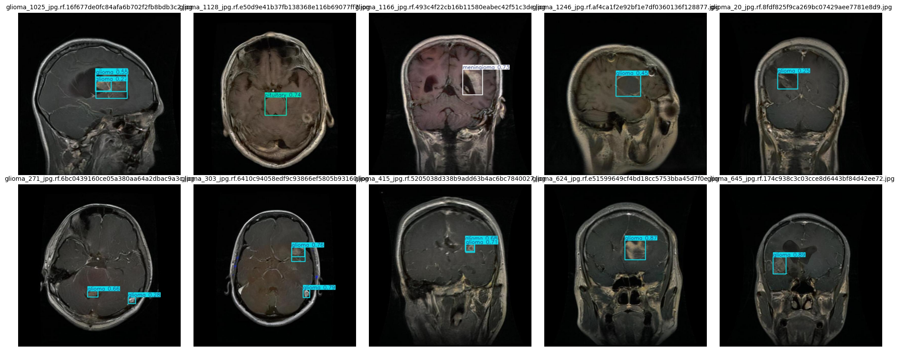 |

### Label & Correlogram Analysis

* 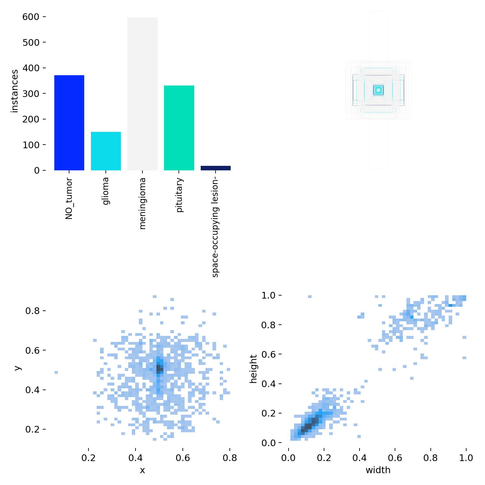
* 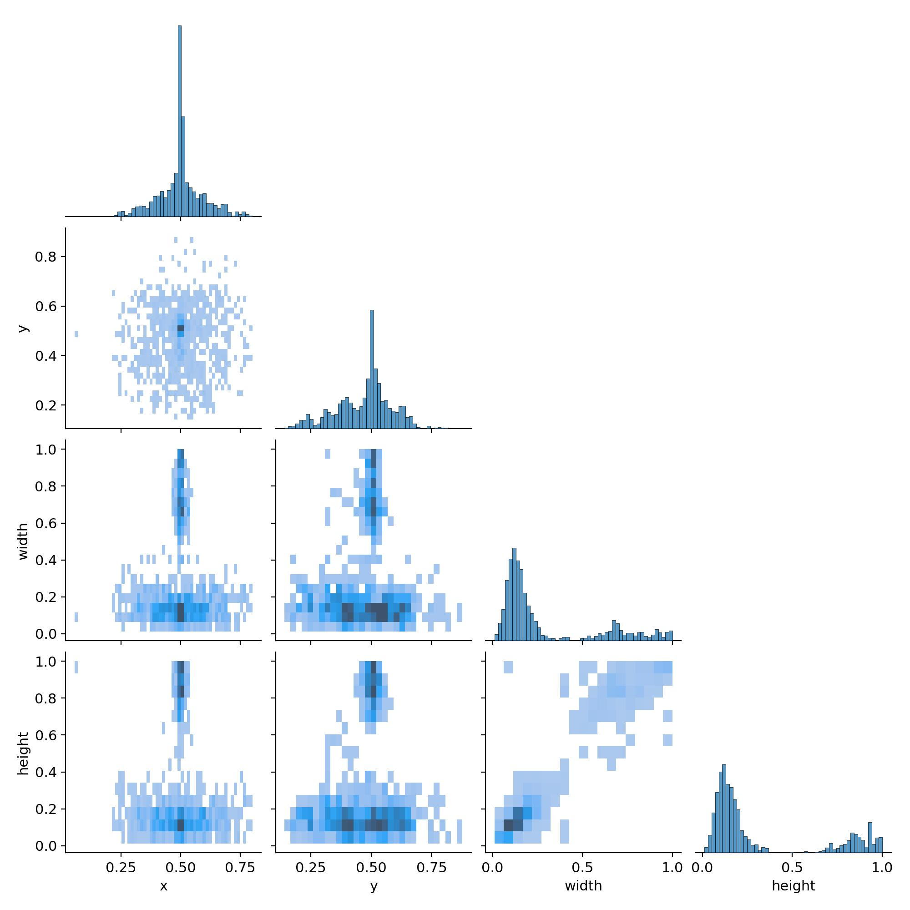

### Batch Previews

| Training Batch                          | Validation Labels                           | Validation Predictions                         |
| --------------------------------------- | ------------------------------------------- | ---------------------------------------------- |
| 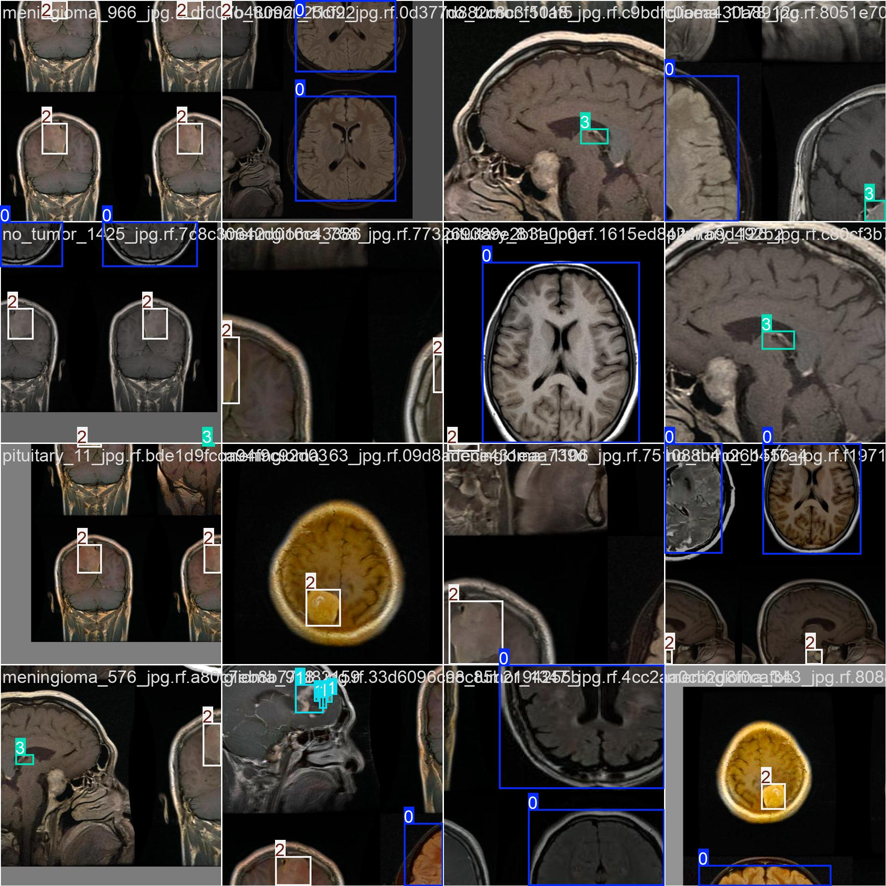 | 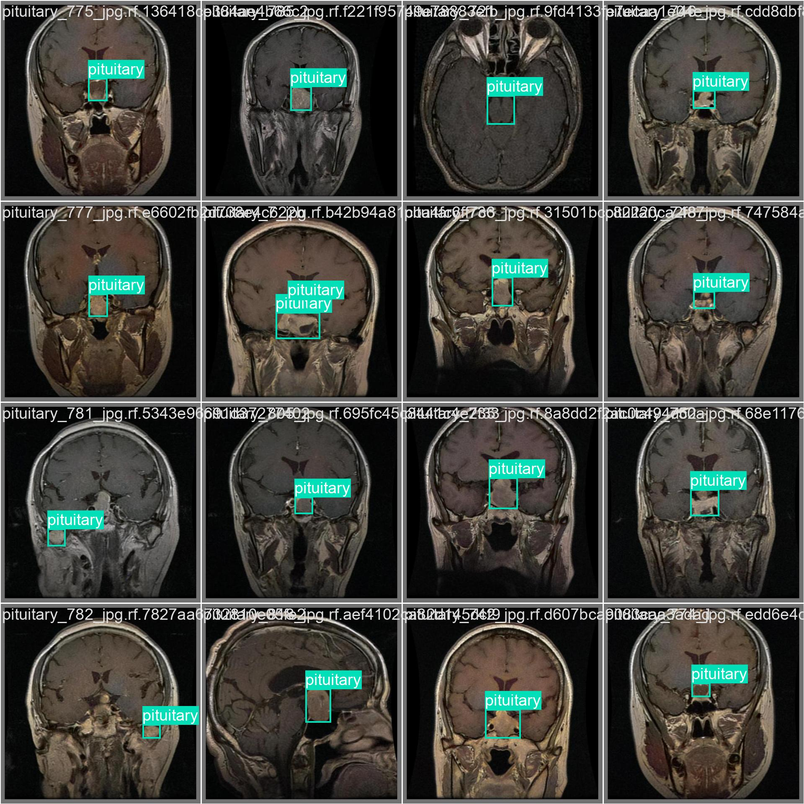 | 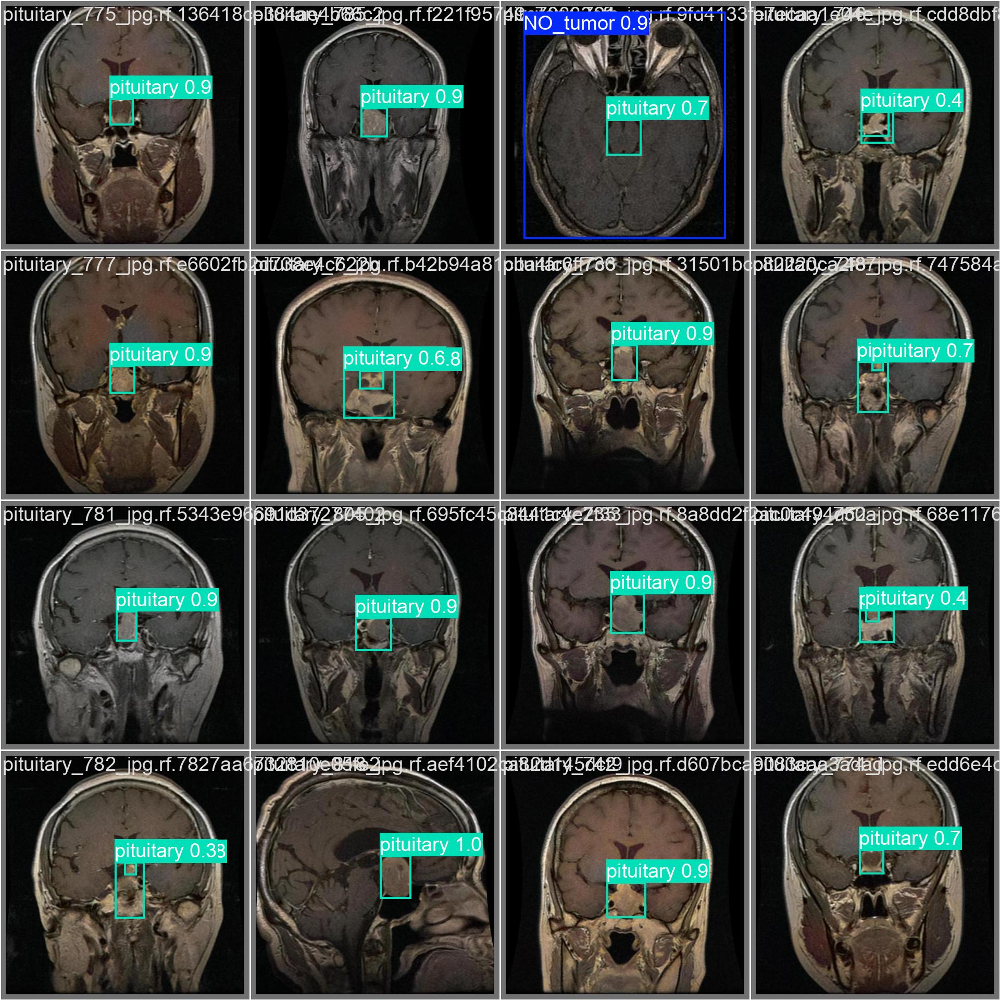 |

### Overall Results

* 

---

## Acknowledgements

* Dataset from \
* Inspired by medical segmentation papers and YOLO-based architectures
* Libraries: `PyTorch`, `OpenCV`, `Matplotlib`, `Seaborn`, `NumPy`, etc.

---

## License

This project is licensed under the MIT License. See the [LICENSE](LICENSE) file for details.
